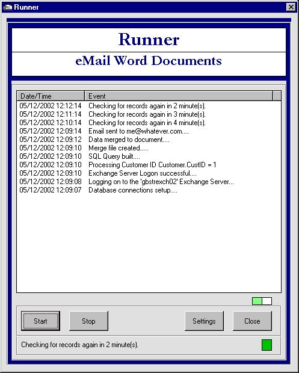



## Runner

### Description

This app. will merge data from Access to a Word document and then send the document out as an attachment using Collaborative Data Objects (CDO).

Some Keywords:

Outlook, MAPI, NameSpace, MailItem, Recipient, Attachment, FileSystemObject, ADODB.Connection, ADODB.Recordset, ADO 2.6, Word.Application, MailMerge, OpenDataSource, SQL creation, Array, HotCode, Spaniel (you have to find it)

You will have to do a bit of work to get set up (if you don't have CDO/Exchange Server), but you can adapt the Outlook function I have in order to do the emailing.

Any questions, then please drop them on the site and I'll endeavour to get back to you.

Cheers, and if there are any bugs, stodgy code etc then let me know and I'll try to fix. I hope that you find this interesting and if you do and like the cut of my code, then give me a rating. Cheers

Regards,

The GazMan
 
### More Info
 

             |
---                |---
**Submitted On**   |2002-12-05 12:17:04
**By**             |[GazMan](https://github.com/Planet-Source-Code/PSCIndex/blob/master/ByAuthor/gazman.md)
**Level**          |Advanced
**User Rating**    |5.0 (15 globes from 3 users)
**Compatibility**  |VB 6\.0
**Category**       |[Complete Applications](https://github.com/Planet-Source-Code/PSCIndex/blob/master/ByCategory/complete-applications__1-27.md)
**World**          |[Visual Basic](https://github.com/Planet-Source-Code/PSCIndex/blob/master/ByWorld/visual-basic.md)
**Archive File**   |[Runner1508181252002\.zip](https://github.com/Planet-Source-Code/gazman-runner__1-41274/archive/master.zip)

